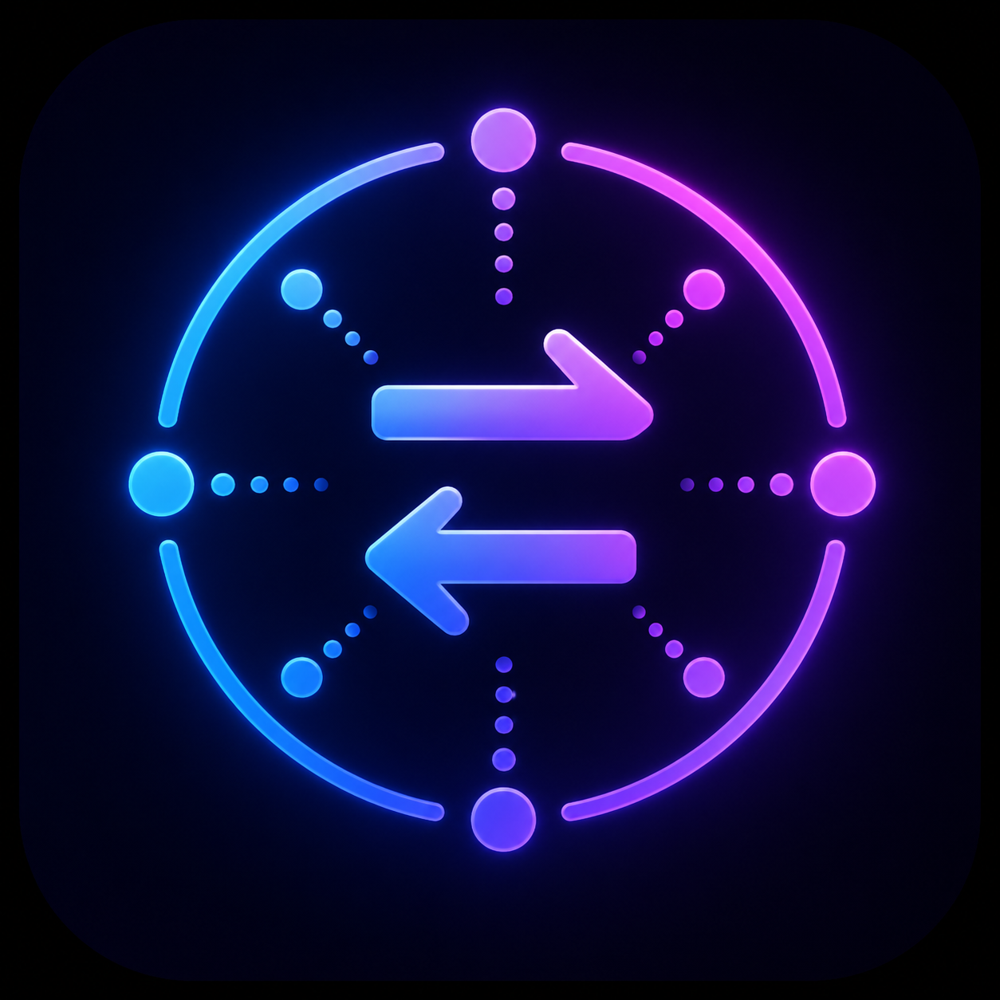

# BlueNox Android BLE Library

[](https://developer.android.com/)
[](https://developer.android.com/guide/topics/manifest/uses-sdk-element)
[](https://kotlinlang.org/)
[](LICENSE)



BlueNox is a Kotlin-first Android BLE library focused on reliable scan/connect/GATT operations with structured failure handling, callback and Flow APIs, and optional beacon/DFU-oriented workflows.

## Table of contents

- [Overview](#overview)
- [Features](#features)
- [Requirements](#requirements)
- [Installation](#installation)
- [Permissions](#permissions)
- [Quick start](#quick-start)
- [Documentation map](#documentation-map)
- [Use cases](#use-cases)
- [Tags / topics](#tags--topics)
- [License](#license)

## Overview

We built the original Android BlueNox library back in 2015, when Android 4 Bluetooth Stack
had every kind of issue you could imagine. We've updated it in the years since to support
every version.

A few years ago we modernized the library to Kotlin and began shipping that version in application. We're releasing it because we want to make it easier for developers to write amazing BLE enabled applications.

## Features

- BLE scanning with optional filters (address, UUID, manufacturer ID, AD type).
- Device connection management and disconnection controls.
- GATT operations: read, write, notifications, MTU, connection priority, reliable write.
- Structured failure taxonomy via callback events for app-level retry/recovery logic.
- Kotlin `SharedFlow` adapter for coroutine-first event consumption.
- Beacon frame decoding helpers (iBeacon, Eddystone variants).
- Diagnostics and test-oriented mock BLE harness support.
- Broad Android Support - Android API 24+ Android 7.0 to Android 15

## Requirements

- Android API 24+ - Android 7.0 to Android 15
- Kotlin Android project
- BLE-capable device and runtime BLE permissions granted by user

## Installation

You can easily integrate the repo from the artifact repository:

```kotlin
dependencies {
    implementation("com.argenox:bluenox-android:<version>")
}
```


## Permissions

Runtime BLE permissions must be requested by the host app before initialization.

Recommended pattern:

1. Get required permissions from `BluenoxLEManager.getInstance().requiredPermissions()`.
2. Request them at runtime.
3. Initialize only after permissions are granted.

On newer Android versions, Bluetooth runtime permissions are required; location requirements vary by API level and scan behavior.

## Quick start

```kotlin
val manager = BluenoxLEManager.getInstance()

val initialized = manager.initialize(applicationContext)
if (!initialized) return

manager.scanForDevices(10_000L)
```

Then connect to a discovered device and perform read/write/notify through `BlueNoxDevice`.

## Documentation map

This README is intentionally concise. Use the companion docs for full details:

- `LIBRARY_USAGE_GUIDE.md` - end-to-end integration patterns, callback and Flow examples, lifecycle guidance.
- `API_REFERENCE.md` - manager/device APIs, callback contracts, failure taxonomy, event model.
- `LICENSE` - Apache 2.0 full license text.
- `NOTICE` - attribution and notice information.

## Use cases

- Medical, wearable, sensor, and industrial BLE apps.
- Production apps requiring deterministic error handling and telemetry.
- Apps migrating from callback-heavy code to coroutine/Flow event streams.
- Teams needing mock BLE scenario replay during development or testing.

## Tags / topics

`android` `ble` `bluetooth-low-energy` `kotlin` `gatt` `scan` `connect` `notifications` `mtu` `beacon` `eddystone` `ibeacon` `dfu`

## License

BlueNox is distributed under the Apache License 2.0.

- `LICENSE` - full Apache-2.0 terms
- `NOTICE` - attribution notice
